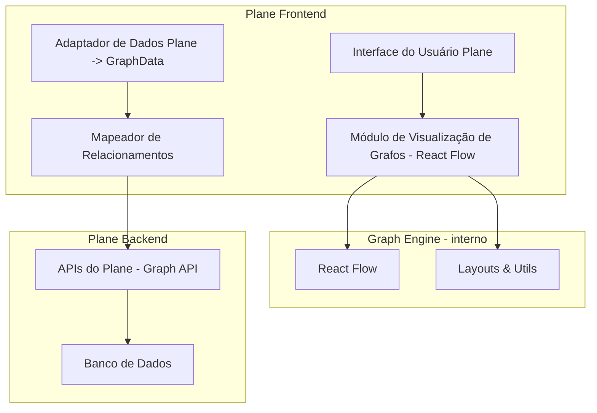

# Plano de Integração: Visualização de Grafos (estilo AFFiNE) no Plane usando React Flow

## Visão Geral

Objetivo: integrar ao Plane uma visualização de grafos que:

1. **Visualização Standalone de Grafos**  
   - Uma view/canvas independente (full-screen, "sem bordas"), para navegar visualmente pelo trabalho.

2. **Mapeamento de Relacionamentos do Plane**  
   - Visualizar conexões entre objetos do Plane:
     - Work items (issues),
     - Cycles (sprints),
     - Modules,
     - Views,
     - Pages (wiki/project pages, quando existirem).

3. **Interação Direta no Grafo**  
   - Criar/editar relacionamentos arrastando nós (drag-and-drop),
   - Abrir/editar detalhes de itens diretamente a partir do grafo,
   - Inspirado no modo edgeless/graph do AFFiNE, mas implementado com **React Flow**.

---

## Arquitetura da Solução



### Papéis dos componentes

- **PGV (Graph Visualization Module)**  
  - Componentes React para renderizar o grafo com React Flow.
  - UI (toolbar, filtros, minimap, modo full-screen).

- **PDA (Plane Data Adapter)**  
  - Converte dados vindos das APIs do Plane (`issues`, `cycles`, `modules`, `pages`, `views`) para o formato `GraphData`.

- **PRM (Relationship Mapper)**  
  - Decide quais relações viram arestas:
    - `depends_on`, `blocks`, `parent_of` (epic/module), `links_to` (pages), etc.
  - Pode aplicar regras por "escopo" (ex.: projeto, cycle, módulo).

- **Graph Engine (React Flow + layouts)**  
  - React Flow como engine de visualização/interação.
  - Helpers de layout (force, hierárquico, circular), utilizando libs auxiliares se necessário.

---

## Objetos do Plane para Visualização

### 1. Work Items (Issues)

- **Relações**:
  - `blocks` / `depends_on` (dependências),
  - `parent_of` (sub-issues, se houver),
  - relação com epic/module.

- **Visualização**:
  - Grafo de dependências (cards coloridos por status),
  - Hierarquia de tarefas (parent/child).

### 2. Cycles (Sprints)

- **Relações**:
  - Work items atribuídos ao cycle,
  - Ligação cycle → module → project (se aplicável).

- **Visualização**:
  - Nó "cycle" como agrupador,
  - grafo de issues do cycle,
  - possibilidade de focar apenas num cycle.

### 3. Modules

- **Relações**:
  - Work items pertencentes,
  - dependências entre modules.

- **Visualização**:
  - Estrutura de módulos como nós "maiores",
  - issues como nós filhos ligados ao módulo.

### 4. Views

- **Relações**:
  - View → conjunto de work items (resultado do filtro),
  - view ligada a module/project.

- **Visualização**:
  - Útil para mostrar "mapa de views" em workspaces grandes (opcional).

### 5. Pages (Wiki / Project Pages)

- **Relações**:
  - Page → page (links internos),
  - Page → issues (quando mencionadas/relacionadas).

- **Visualização**:
  - Rede de conhecimento / wiki graph,
  - interessante quando o Plane tiver wiki consolidada.

---

## Formato de Dados do Grafo (contrato frontend/backend)

```typescript
interface GraphNode {
  id: string;
  type: 'issue' | 'cycle' | 'module' | 'page' | 'view';
  label: string;
  metadata: Record<string, any>;
  position?: { x: number; y: number }; // opcional: posições salvas
}

interface GraphEdge {
  id: string;
  source: string;
  target: string;
  type: 'blocks' | 'depends_on' | 'parent_of' | 'links_to';
  metadata?: Record<string, any>;
}

interface GraphData {
  nodes: GraphNode[];
  edges: GraphEdge[];
  layout?: 'force' | 'hierarchical' | 'circular';
}
```

- `metadata` permite carregar:
  - status, assignee, prioridade, labels, etc.
- `position` é usado para:
  - salvar layout customizado pelo usuário,
  - misturar com layout automático da sessão.

---

## APIs Necessárias (sugestão)

Em vez de muitos endpoints específicos, usar um endpoint **parametrizado**, por exemplo:

- `GET /api/workspaces/{workspaceId}/graph`

Com query params para escopo:

- `scope=workspace` (default): grafo geral (com filtros).
- `scope=project&projectId=...`
- `scope=cycle&cycleId=...`
- `scope=module&moduleId=...`
- `scope=issue&issueId=...`
- `scope=page&pageId=...`

Possíveis filtros:

- `types=issue,module,page`
- `maxDepth=2`
- `includeLinks=true|false`

### Endpoints de Edição de Relações

- `POST /api/relationships`
  - body: `{ sourceId, targetId, type }`
- `DELETE /api/relationships/{relationshipId}`

Opcionalmente:

- `PATCH /api/graph/layout`
  - para salvar `position` de vários nós de uma vez.

---

## Estrutura de Diretórios Proposta

```text
plane/
├── apps/
│   └── web/
│       └── core/
│           └── components/
│               └── graph-visualization/
│                   ├── views/                 # Entry points (ProjectGraphView, CycleGraphView, etc.)
│                   ├── standalone/           # Ferramenta full-screen / "janela sem bordas"
│                   ├── adapters/             # Plane -> GraphData (PDA)
│                   ├── relationship-mapper/  # PRM: regras de mapeamento de relações
│                   ├── hooks/                # Hooks React (useGraphData, useGraphFilters)
│                   ├── layout/               # Lógica de layout (force, hierárquico, etc.)
│                   └── utils/                # Utilitários (conversão, temas, etc.)
└── packages/
    └── graph-engine/
        ├── react-flow/       # Componente base encapsulando React Flow com defaults
        ├── types/            # TS types (GraphNode, GraphEdge, GraphData)
        └── theme/            # Configuração visual, estilos, nós customizados
```

- **Observação**: `packages/graph-engine` agora é pensado como um **wrapper em torno do React Flow**, não uma cópia do código do AFFiNE.

---

## Uso de React Flow

### Componentes-chave

- `ReactFlow` para canvas de grafo.
- `MiniMap`, `Controls`, `Background` para:
  - visão geral,
  - controles de zoom/pan,
  - aparência.

### Customização

- **Custom Node Types**:
  - `IssueNode`, `CycleNode`, `ModuleNode`, `PageNode`, `ViewNode`:
    - cores por tipo,
    - badges de status/prioridade,
    - ícone de assignee.
- **Custom Edge Types**:
  - estilos diferentes para:
    - `depends_on` vs `blocks` vs `links_to`.
- **Interações**:
  - `onNodeClick`: abre drawer com detalhes (issue, etc.).
  - `onConnect`: cria `GraphEdge` → chama API `POST /relationships`.
  - `onNodesChange`: capturar drag/move → salvar `position` (opcional).

---

## Considerações de Performance

- **Virtualização**:
  - React Flow já é razoável com centenas de nós, mas:
    - limitar nós/arestas pelo filtro (não mostrar o workspace inteiro sem critério),
    - permitir "expandir" vizinhança aos poucos (ex.: "show neighbors").

- **Lazy Loading**:
  - Carregar detalhes dos nós sob demanda (por exemplo, metadata pesada apenas ao abrir o painel de detalhes).
  - GraphData inicial pode conter infos básicas; detalhes vêm de endpoint de issue/epic quando necessário.

- **Layouts pesados**:
  - Cálculos de layout (force-directed, etc.) podem ser feitos:
    - no backend (por job rápido),
    - ou no frontend via Web Workers, se o desempenho exigir.

---

## UX/UI

- **Modo "janela sem bordas" (inspirado no AFFiNE)**:
  - Rota dedicada `/graph` ou `/projects/:id/graph`.
  - Layout:
    - Header mínimo (voltar, filtros),
    - Canvas ocupando quase tudo,
    - Barra lateral colapsável para detalhes.

- **Fatores de UX**:
  - Modo claro/escuro seguindo tema do Plane.
  - Atalhos de teclado:
    - zoom in/out,
    - centrar grafo,
    - alternar tipo de layout.
  - Tooltips nos nós/arestas com sumário rápido.
  - Mini-mapa (React Flow `MiniMap`) para navegação.

- **Edição de relações via drag-and-drop**:
  - UX:
    - usuário arrasta de uma "handle" de um nó a outro,
    - abre popover para escolher tipo de link (`blocks`, `depends_on`, `links_to`),
    - confirma → cria `GraphEdge` e chama API.

---

## Fases de Implementação (versão refinada)

### Fase 1: MVP de Graph View (React Flow, apenas issues)

- Integrar React Flow no projeto (como `packages/graph-engine/react-flow`).
- Criar:
  - `GraphNode`, `GraphEdge`, `GraphData`.
- Backend:
  - Endpoint simples `GET /api/workspaces/{id}/graph?scope=project&projectId=...`
  - Retornar issues + dependências básicas (`depends_on`/`blocks`).
- Frontend:
  - `ProjectGraphView`:
    - canvas com nós (issues) e arestas (dependências),
    - pan/zoom,
    - clique no nó abre drawer de issue.

### Fase 2: Expandir objetos (cycles, modules, pages, views)

- Backend:
  - Estender GraphData para incluir:
    - cycles, modules, pages, views.
- Frontend:
  - Implementar tipos de nó visuais diferentes.
  - Filtros de tipo (checkboxes: issues, cycles, modules, pages).
  - Views específicas:
    - `CycleGraphView`,
    - `ModuleGraphView`.

### Fase 3: Interação avançada (edição de relacionamentos)

- Implementar `onConnect` em React Flow:
  - Criar relações via `POST /relationships`.
- Implementar exclusão de arestas:
  - clique na aresta → menu "remover relação".
- Opcional:
  - persistir layout (salvar `position`) via `PATCH /graph/layout`.

### Fase 4: Canvas "sem bordas" + polish

- Criar rota full-screen:
  - `/graph` com layout minimamente intrusivo.
- Adicionar:
  - `MiniMap`, `Controls`, `Background`.
  - Animações suaves.
- Resolver detalhes visuais:
  - bordas, sombras, cores,
  - ícones consistentes com o design system do Plane.

### Fase 5: Qualidade e Performance

- Testes:
  - unitários para adapters e mapeadores,
  - testes de integração do GraphView.
- Testes de carga:
  - grafos com 200–500 nós.
- Otimizações:
  - filtros padrão para evitar overload,
  - lazy loading de vizinhança se necessário.

### (Fase futura) Integração com IA

- Botão "Ask AI about this graph" que:
  - envia `GraphData` filtrado ao backend,
  - backend chama LLM (Bedrock),
  - UI mostra insights, e opcionalmente aplica mudanças.

---

## Riscos e Mitigações (atualizado)

| Risco | Impacto | Mitigação |
|-------|---------|-----------|
| Complexidade de extrair código do AFFiNE | Alto | **Substituído por React Flow** como engine principal; AFFiNE fica apenas como inspiração de UX |
| Performance com muitos nós | Médio | Filtros agressivos, expansão incremental, teste com cargas reais, Web Worker se necessário |
| Conflitos de estilo CSS | Baixo | Uso do design system do Plane, CSS Modules/Styled Components, namespacing |
| Compatibilidade com futuras versões do Plane | Médio | Encapsular o módulo de grafo (PGV) e usar contratos de API estáveis (`GraphData`), testes E2E |

---

## Métricas de Sucesso (mantidas)

- ✅ Renderização de grafos com ~500 nós em < 2s (após fetch)  
- ✅ Navegação fluida (próximo de 60 FPS) em zoom/pan em casos comuns  
- ✅ Visualização de todos os tipos relevantes de objeto (issues, cycles, modules, pages)  
- ✅ Edição de relacionamentos via drag-and-drop com feedback claro  
- ✅ Exportação das visualizações (SVG/PNG ou screenshot integrado)  
- ✅ Cobertura de testes > 80% no módulo de grafos  

---

## Próximos Passos

1. **Consolidar este plano** como documento interno (ex.: `GRAPH_DESIGN.md` no repo do Plane).
2. **Adicionar React Flow** à base do Plane e criar o módulo `graph-engine` com tipos/tema.
3. Implementar a **Fase 1 (MVP)**:
   - endpoint simples de grafo de issues,
   - `ProjectGraphView` com React Flow.
4. Testar com dados reais e ajustar UX antes de ir para as fases de interatividade e polish.

---

## 📊 Tracker de Progresso de Implementação

### Status Geral: 🟢 MVP Funcional (65% concluído)

### ✅ Fase 1: Fundação (100% concluída)

| Item | Status | Descrição |
|------|--------|-----------|
| React Flow | ✅ Completo | Instalado e configurado no projeto |
| Tipos TypeScript | ✅ Completo | GraphNode, GraphEdge, GraphData definidos em `packages/graph-engine/src/types` |
| Módulo graph-engine | ✅ Completo | Wrapper do React Flow criado com configuração base |
| GraphCanvas | ✅ Completo | Componente principal com controles, minimap e background |
| Tema e estilos | ✅ Completo | Sistema de temas light/dark implementado |
| Estrutura de diretórios | ✅ Completo | Organização conforme plano estabelecido |
| Adaptador de dados | 🟡 Em progresso | PlaneDataAdapter criado em `apps/web/core/components/graph-visualization/adapters` |

### ✅ Fase 2: Componentes Core (100% concluída)

| Item | Status | Descrição |
|------|--------|-----------|
| IssueNode | ✅ Completo | Componente customizado com visual detalhado (258 linhas) |
| CycleNode | ✅ Stub criado | Componente básico funcional, pronto para expansão |
| ModuleNode | ✅ Stub criado | Componente básico funcional, pronto para expansão |
| PageNode | ✅ Stub criado | Componente básico funcional, pronto para expansão |
| ViewNode | ✅ Stub criado | Componente básico funcional, pronto para expansão |
| Edges customizados | ✅ Completo | BlocksEdge, DependsOnEdge, ParentOfEdge, LinksToEdge |
| ProjectGraphView | ✅ Completo | Componente principal com 392 linhas, totalmente funcional |

### ❌ Fase 3: Backend (0% concluída)

| Item | Status | Descrição |
|------|--------|-----------|
| Endpoint GET /graph | ❌ Pendente | API para buscar dados do grafo |
| Endpoint POST /relationships | ❌ Pendente | API para criar relações |
| Endpoint PATCH /layout | ❌ Pendente | API para salvar posições |
| Integração com DB | ❌ Pendente | Queries para buscar relacionamentos |

### ✅ Fase 4: Utilitários e Hooks (100% concluída)

| Item | Status | Descrição |
|------|--------|-----------|
| GraphUtils | ✅ Completo | Utilitários para manipulação de grafos (30 linhas) |
| LayoutUtils | ✅ Completo | Funções de layout grid, circular, random (36 linhas) |
| FilterUtils | ✅ Completo | Sistema de filtros por tipo, status, prioridade, busca (48 linhas) |
| useGraphData | ✅ Completo | Hook para gerenciar dados do grafo |
| useGraphFilters | ✅ Completo | Hook para gerenciar filtros com update e clear |
| useGraphLayout | ✅ Completo | Hook para gerenciar layout |
| useGraphInteractions | ✅ Completo | Hook para interações (click, connect, edge click) |
| Layouts avançados | 🟡 Stubs | Force e Hierarchical layouts (stubs prontos para implementação) |

### 🟡 Fase 5: Funcionalidades Avançadas (33% concluída)

| Item | Status | Descrição |
|------|--------|-----------|
| Drag-and-drop para criar relações | ✅ Completo | Implementado via onConnect no ProjectGraphView |
| Filtros visuais na UI | ✅ Completo | Checkboxes para tipos, botão clear filters |
| Modo full-screen | ❌ Pendente | Rota dedicada /graph |
| Persistência de layout | ❌ Pendente | Endpoint PATCH para salvar posições |
| Lazy loading | ❌ Pendente | Carregar nós sob demanda |
| Exportação (SVG/PNG) | ❌ Pendente | Funcionalidade de export |

### 📁 Arquivos Criados

```
✅ packages/graph-engine/ (Módulo compilado - 187.48 kB total)
   ├── package.json (dependências e exports)
   ├── tsconfig.json (configuração TypeScript)
   ├── tsdown.config.ts (configuração de build)
   ├── README.md (334 linhas - documentação completa)
   ├── dist/ (arquivos compilados CJS + ESM + types)
   └── src/
       ├── index.ts (41 linhas - exports principais)
       ├── types/index.ts (319 linhas - tipos completos)
       ├── theme/index.ts (320 linhas - temas light/dark)
       ├── react-flow/
       │   └── GraphCanvas.tsx (411 linhas - componente principal)
       ├── nodes/
       │   ├── IssueNode.tsx (258 linhas - completo)
       │   ├── CycleNode.tsx (20 linhas - stub)
       │   ├── ModuleNode.tsx (20 linhas - stub)
       │   ├── PageNode.tsx (20 linhas - stub)
       │   └── ViewNode.tsx (20 linhas - stub)
       ├── edges/
       │   ├── BlocksEdge.tsx (41 linhas)
       │   ├── DependsOnEdge.tsx (17 linhas)
       │   ├── ParentOfEdge.tsx (17 linhas)
       │   └── LinksToEdge.tsx (17 linhas)
       ├── layouts/ (stubs para implementação futura)
       │   ├── ForceLayout.ts (11 linhas)
       │   ├── HierarchicalLayout.ts (11 linhas)
       │   └── CircularLayout.ts (11 linhas)
       ├── utils/
       │   ├── GraphUtils.ts (30 linhas - funcionais)
       │   ├── LayoutUtils.ts (36 linhas - 3 layouts)
       │   └── FilterUtils.ts (48 linhas - filtros completos)
       └── hooks/
           ├── useGraphData.ts (19 linhas)
           ├── useGraphFilters.ts (21 linhas)
           ├── useGraphLayout.ts (11 linhas)
           └── useGraphInteractions.ts (26 linhas)

✅ apps/web/core/components/graph-visualization/
   ├── index.ts (46 linhas - barrel exports atualizado)
   ├── adapters/
   │   └── PlaneDataAdapter.ts (629 linhas - conversão de dados)
   ├── views/
   │   ├── ProjectGraphView.tsx (392 linhas - view principal)
   │   ├── CycleGraphView.tsx (233 linhas - view de ciclos)
   │   └── ModuleGraphView.tsx (233 linhas - view de módulos)
   └── examples/
       └── ProjectGraphExample.tsx (74 linhas - exemplo de uso)

✅ apps/api/plane/app/views/
   └── graph.py (662 linhas - endpoints de backend)
       ├── WorkspaceGraphEndpoint (GET /workspaces/{id}/graph)
       ├── ProjectGraphEndpoint (GET /projects/{id}/graph)
       └── GraphRelationshipEndpoint (POST /relationships)

✅ apps/api/plane/app/urls/
   └── graph.py (27 linhas - rotas de API)
```

### 🚀 Próximas Ações Imediatas

1. **Compilar o módulo graph-engine**: Executar `pnpm build` no diretório do módulo
2. **Criar ProjectGraphView**: Implementar o componente principal de visualização
3. **Implementar endpoint backend**: Criar API GET /api/workspaces/{id}/graph
4. **Testar integração básica**: Visualizar um grafo simples com dados mockados
5. **Completar implementação dos nós customizados**: Adicionar funcionalidades completas aos stubs

### 📝 Notas de Implementação

- **Dependências instaladas**: React Flow v11.11.4 adicionado ao projeto
- **TypeScript**: Todos os tipos base foram definidos e exportados
- **Modularização**: Código organizado em módulo separado para reusabilidade
- **Stubs criados**: Componentes básicos criados para permitir compilação
- **Próximo milestone**: MVP funcional com visualização de issues

---

*Última atualização: 16/11/2024 01:14 UTC-3*